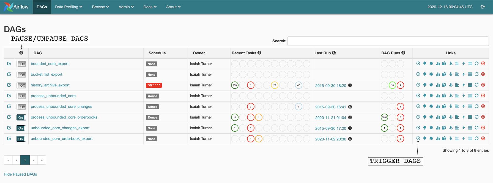
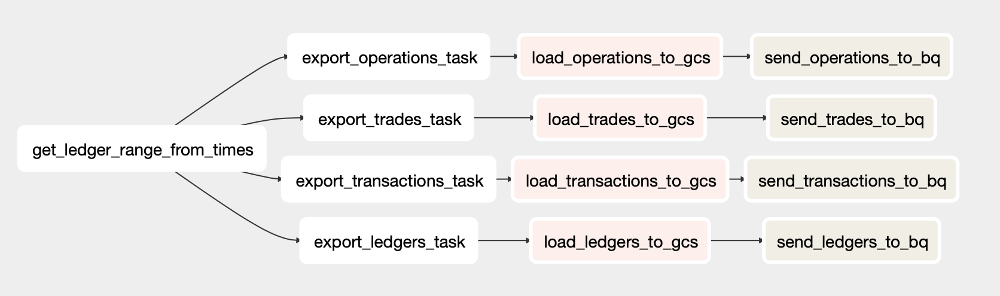
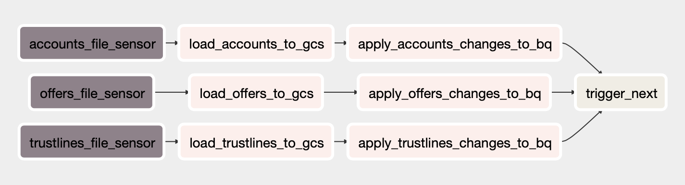
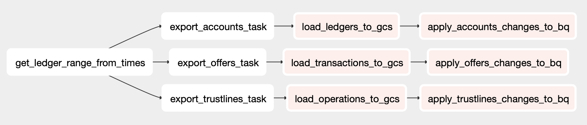
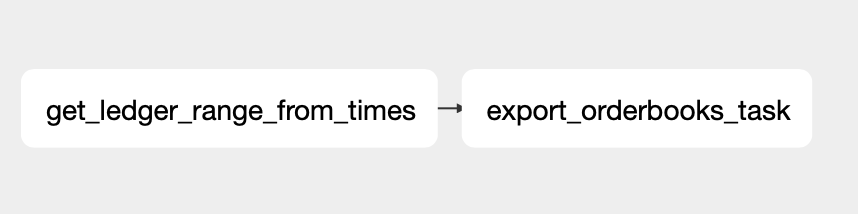
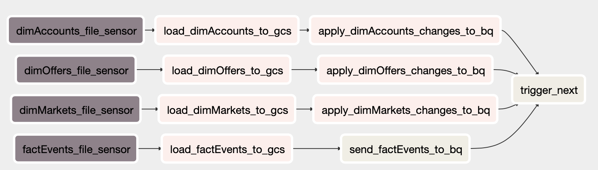

# stellar-etl-airflow
This repository contains the Airflow DAGs for the [Stellar ETL](https://github.com/stellar/stellar-etl) project. These DAGs provide a workflow for exporting data from the Stellar network and uploading the data into BigQuery.

# Table of Contents
- [Installation and Setup](#installation-and-setup)
	- [Cloud Composer](#cloud-composer)
    - [Custom Kubernetes Setup](#custom-kubernetes-setup)
	- [Manual Installation](#manual-installation)
	- [Airflow Variables Explanation](#airflow-variables-explanation)
	  - [Normal Variables](#normal-variables)
	  - [Kubernetes Specific Variables](#kubernetes-specific-variables) 
- [Execution Procedures](#execution-procedures)
- [Understanding the Setup](#understanding-the-setup)
  - [DAG Diagrams](#dag-diagrams)
  - [Task Explanations](#task-explanations)
- [Further Development](#further-development)
  - [Extensions](#extensions)
  - [Remaining Project TODOs](#remaining-project-todos)

# Installation and Setup
## Cloud Composer
Cloud Composer is the preferred method of deployment. [Cloud Composer](https://cloud.google.com/composer) is a managed service used for Airflow deployment that provides much of the infrastructure required to host an Airflow instance. The steps for setting up a Cloud Composer environment are detailed below.

### Setup the Cloud SDK
- Download the [Google Cloud SDK](https://cloud.google.com/sdk/docs/quickstart#installing_the_latest_version).
- [Initialize the Cloud SDK](https://cloud.google.com/sdk/docs/quickstart#initializing_the) and login to your Google account

### Create Google Project
- Login to the [Google Cloud Console](https://console.cloud.google.com/cloud-resource-manager)
- Create a new [Google Project](https://cloud.google.com/resource-manager/docs/creating-managing-projects#creating_a_project)
> **_NOTE:_** The project name you choose corresponds to the Airflow variable "bq_project".

### Create BigQuery Dataset
- Log in to Google [BigQuery](https://cloud.google.com/bigquery)
- [Create](https://cloud.google.com/bigquery/docs/datasets#create-dataset) a new dataset with the desired name
> **_NOTE:_** The dataset name you choose corresponds to the Airflow variable "bq_dataset".

### Create Google Cloud Storage bucket
- Open the [Cloud Storage browser](https://console.cloud.google.com/storage/browser)
- [Create](https://cloud.google.com/storage/docs/creating-buckets) a new Google Storage bucket that will store exported files
> **_NOTE:_** The dataset name you choose corresponds to the Airflow variable "gcs_exported_data_bucket_name".

> **_WARNING:_** Make sure that you adhere to the [location requirements](https://cloud.google.com/bigquery/docs/loading-data-cloud-storage) for Cloud Storage buckets and BigQuery datasets. Otherwise, it will not be possible to upload data to BigQuery.

### Create Google Cloud Composer environment
Create a new Cloud Composer environment using the command below or the [UI](https://cloud.google.com/composer/docs/how-to/managing/creating#creating_a_new_environment):
```bash
gcloud composer environments create <environment_name> --location=<project_location> \
--zone=<project_zone> --disk-size=100GB --machine-type=n1-standard-4 \
--node-count=3 --python-version=3 --image-version=composer-1.12.0-airflow-1.10.10 \
--oauth-scopes=['https://www.googleapis.com/auth/cloud-platform'] \
--service-account=<service_account>

gcloud composer environments update <environment_name> \
--location=<project_location> --update-pypi-package=docker==3.7.3
```
Remember to adjust the disk size, machine type, and node count to fit your needs. The python version must be 3, and the image must be `composer-1.12.0-airflow-1.10.10` or later. See [the command reference page](https://cloud.google.com/sdk/gcloud/reference/composer/environments/create) for a detailed list of parameters.
> **_TROUBLESHOOTING:_** If the environment creation fails because the "Composer Backend timed out" try disabling and enabling the Cloud Composer API. If the creation fails again, try creating a service account with Owner permissions and use it to create the Composer environment.

Cloud Composer may take a while to setup the environment. Once the process is finished, you can view the environment by going to the [Composer section of the Cloud Console](https://console.cloud.google.com/composer/environments).
> **_NOTE:_** Creating an environment will also create a new Google Cloud Storage bucket. You can check this bucket's name by clicking on the DAGs folder link in the Composer section of the Cloud Console. This name corresponds to the Airflow variable "gcs_bucket_name".

### Upload DAGs and Schemas to Cloud Composer
After the environment is created, select the environment and navigate to the environment configuration tab. Look for the value under **DAGs folder**. It will be of the form `gs://airflow_bucket/dags`. The `airflow_bucket` value will be used in this step and the next . Run the command below in order to upload the DAGs and schemas to your Airflow bucket.
```bash
> bash upload_static_to_gcs.sh <airflow_bucket>
```

Afterwards, you can navigate to the Airflow UI for your Cloud Composer environment. To do so, navigate to the [Composer section of the Cloud Console](https://console.cloud.google.com/composer/environments), and click the link under `Airflow Webserver`. Then, pause the DAGs by clicking the on/off toggle to the left of their names. DAGs should remain paused until you have finished setting up the environment. Some DAGs may not show up due to errors that will be fixed as the following steps are completed.

### Add Service Account Key
The Airflow DAGs require service account keys to perform their operations. Generate a [service account key](https://cloud.google.com/iam/docs/creating-managing-service-account-keys#creating_service_account_keys) for a service account that has access to BigQuery and Google Cloud Storage. Then, add this key file to the data folder in your <airflow_bucket>.

> **_NOTE:_** The name of the key file corresponds to the Airflow variable "api_key_path". The data folder in Cloud Storage corresponds to the path "/home/airflow/gcs/data/", but ensure that the variable has the correct filename.

### (Optional) Add Kubernetes Node Pool
Find the Kubernetes cluster name that is used by your Cloud Composer environment. To do so, select the environment, navigate to environment configuration, and look for the value of **GKE cluster**. The cluster name is the final part of this path.

Then, run the command:

```bash
gcloud container node-pools create <pool_name> --cluster <cluster_name> \
--zone <composer_zone> --project <project_id>
```

> **_NOTE:_** The name of the pool will be used in the Airflow variable "affinity".

### Create Namespace for ETL Tasks
Open the Google [Cloud Shell](https://cloud.google.com/shell). Run these commands:
```bash
gcloud container clusters get-credentials <cluster_name> --region=<composer_region>

kubectl create ns <namespace_name>

kubectl create clusterrolebinding default-admin --clusterrole cluster-admin \
--serviceaccount=<airflow_worker_namespace>:default --namespace <namespace_name>
```

The first command acquires credentials, allowing you to execute the next commands. The second command creates the new namespace, and the third allows the service account that executes tasks to act in the new namespace.

To find the value of `<airflow_worker_namespace>`, select your Cloud Composer environment, navigate to environment configuration, and look for the value of **GKE cluster**. Click on the link that says "view cluster workloads." A new page will open with a list of Kubernetes workflows. Click on airflow-worker in order to go to the details page for that Deployment. Look for the value of **Namespace**.

> **_NOTE:_** The name of the newly created namespace corresponds to the Airflow variable "namespace".

### Modify Kubernetes Config for Airflow Workers
Find the Kubernetes cluster workloads that are used by your Cloud Composer environment. To do so, select the environment, navigate to environment configuration, and look for the **GKE cluster** section. Click on the link that says "view cluster workloads."

A new page will open with a list of Kubernetes workflows. Click on airflow-worker in order to go to the details page for that Deployment. Click the edit button. This will take you to a tab with a Kubernetes configuration. In subsequent steps, you will edit this file. For an example of a finalized config file, see this [example file](example_airflow-worker_config.yaml). 

> **_WARNING:_** You shouldn't copy the example file directly because it has environment variables and config values that are set up for a different project.

  
> **_NOTE:_** This deployment file contains two separate containers: airflow-worker and gcs-syncd. Only the airflow-worker container should be edited.

<details>
<summary>Mount Docker on Airflow Workers</summary>
In this step, mount the Docker.sock and Docker. In addition, edit the security config so that the container runs as privileged, allowing it to access Docker. See [this commit](https://github.com/marc-chan/cloud_composer_examples/commit/f3e6a202ef0bfd2214385def7e36be33db191df6#diff-fc2e428a07c8d60059e54e5154f0c540) for an example of how to make these changes.
</details>

<details>
<summary>Add Volume for Local Files to Airflow Workers</summary>
In this step, add another volumeMount to airflow-workers. This local path will be used for temporary storage of exported files. In addition, make sure that you add the corresponding volume with the type DirectoryOrCreate.

Here is an example of what your volumeMounts and volumes should look like at the end of this step:
```
...

volumeMounts:
- mountPath: /etc/airflow/airflow_cfg
name: airflow-config

- mountPath: /home/airflow/gcs
name: gcsdir

- mountPath: /var/run/docker.sock
name: docker-host

- mountPath: /bin/docker
name: docker-app

- mountPath: /home/airflow/etlData
name: etl-data
...

volumes:
- configMap:
defaultMode: 420
name: airflow-configmap

name: airflow-config
- emptyDir: {}
name: gcsdir

- hostPath:
path: /var/run/docker.sock
type: ""
name: docker-host

- hostPath:
path: /usr/bin/docker
type: ""
name: docker-app

- hostPath:
path: /home/airflow/etlData
type: DirectoryOrCreate
name: etl-data

```
> **_NOTE:_** The mount path chosen corresponds to the Airflow variable "local_output_path".
</details>

<details>
<summary>Add Poststart Script to Airflow Workers</summary>
Find the namespace name in the airflow-worker config file. It should be near the top of the file, and may look like "composer-1-12-0-airflow-1-10-10-2fca78f7". This value will be used in later commands

Next, open the cloud shell. Keep your airflow-worker configuration file open, or save it. In the cloud shell, create a text file called `poststart.sh` by running the command: `nano poststart.sh`. Then, copy the text from the `poststart.sh` file in this repository into the newly opened file. If you changed the path for the local folder in the previous step, make sure that you edit line 13:
```
for file in /home/airflow/etlData/*
```

It should reflect the path changes you made. Once the file is finalized, run these commands:

```bash
gcloud container clusters get-credentials <cluster_name> --region=<composer_region>

kubectl create configmap start-config --from-file poststart.sh -n <namespace_name>
```

  

Return to the airflow-worker config file. Add a new volumeMount to /etc/scripts.

```
...

volumeMounts:
...
- mountPath: /etc/scripts
name: config-volume
...

```

Then, add a new Volume that links to the configMap you created.

```
...
volumes:
...
- configMap:
	defaultMode: 511
	name: start-config
	name: config-volume
...
```

This will make the script available to the Airflow workers. In order for them to call it automatically, add a postStart hook to airflow-worker above the existing preStop hook.

```
...
lifecycle:
	postStart:
		exec:
			command:
				- /bin/bash
				- /etc/scripts/poststart.sh
preStop:
	exec:
		command:
			- bash
			- -c
			- pkill -f "MainProcess"
...
```

<details>
<summary>Click here if you are interested in knowing what the script does.</summary>

The export tasks in the etl use Docker images with their own filesystems. Mounting a folder to the Docker image allows us to connect the airflow-worker filesystem to the Docker image filesystem. However, there are multiple airflow-worker instances, and tasks are distributed between them. This means that an export task may occur on one worker, and the subsequent task that needs that file could occur on a different worker instance. There needs to be some way to pool all the data from all the worker instances.

Fortunately, Cloud Composer provides a folder at /home/airflow/gcs/data. This folder is described in detail [here](https://cloud.google.com/composer/docs/concepts/cloud-storage). Essentially, the folder is synchronized between all the workers, and it also is linked to the data folder in the environment's Cloud Storage bucket. This means that data stored here will be available to all workers, solving the problem. Unfortunately, since this folder is already connected to a Cloud Storage bucket, it cannot also connect to a Docker image.

Instead, we connect a local folder defined in the previous step. The `poststart.sh` script runs constantly in the background. It moves files from the local folder to the gcs/data folder. The script is more complicated than a simple move command because it needs to ensure that no programs are writing to the files before they are moved.
</details>
</details>

### Add Airflow Variables and Connections
In order to add the Airflow variables and connections, navigate to the Airflow web server. To do so, navigate to the [Composer section of the Cloud Console](https://console.cloud.google.com/composer/environments), and click the link under `Airflow Webserver`.

Click the Admin tab, then Connections. Click create, then:
- Set the **Conn Id** field to `google_cloud_platform_connection`.
- Set the **Conn Type** to `Google Cloud Platform`.
- Set the **Project Id** to your project id
- Set the **Keyfile Path** to <api_key_path>.
- The <api_key_path> should be the same as the Airflow variable "api_key_path".

Next, add the Airflow variables. Click the Admin tab, then Variables. Click the `Choose file` button, select your variables file, and click import variables.

The airflow_variables.txt file provides a set of default values for variables.
  
## Custom Kubernetes Setup
This section is currently unfinished as the Kubernetes setup is still in development.

## Manual Installation
1. Install Airflow v1.10 or later: `pip install apache-airflow`
    - To confirm Airflow is installed, run `airflow -h` and ensure that you see a help screen
2. Install the required packages: `pip install -r requirements.txt`
3. Setup the Airflow database: `airflow initdb`
4. Run Airflow scheduler: `airflow scheduler`
5. Run Airflow web server: `airflow webserver`
6. Add required Airflow variables through [CLI](https://airflow.apache.org/docs/stable/cli-ref#variables) or the [Airflow UI](https://airflow.apache.org/docs/stable/ui.html#variable-view)
7. Add required Airflow connections through the [CLI](https://airflow.apache.org/docs/stable/cli-ref#connections) or [Airflow UI](https://airflow.apache.org/docs/stable/howto/connection/index.html)
    - google_cloud_platform_connection: connection of type google_cloud_platform that connects to a Google Cloud Platform API key for a specific project. See [here](https://cloud.google.com/docs/authentication/api-keys?authuser=1) for more information about API keys.
    - fs_default: connection with fs type that sets the default filepath

## Airflow Variables Explanation
### Normal Variables
| Variable name                 | Description                                                                                                                                        | Should be changed?                                                    |
|-------------------------------|----------------------------------------------------------------------------------------------------------------------------------------------------|-----------------------------------------------------------------------|
| affinity                      | JSON object that represents the pod's [affinity](https://cloud.google.com/composer/docs/how-to/using/using-kubernetes-pod-operator#affinity-config) | Yes, if you followed the optional step and made a new node pool.      |
| api_key_path                  | path to the Google Cloud Platform [API key](https://cloud.google.com/docs/authentication/api-keys?authuser=1)                                      | No, unless your filename is different.                                |
| bq_dataset                    | name of the BigQuery [dataset](https://cloud.google.com/bigquery/docs/datasets)                                                                    | Yes. Change to your dataset name.                                     |
| bq_project                    | name of the BigQuery [project](https://cloud.google.com/resource-manager/docs/creating-managing-projects#console)                                  | Yes. Change to your project name.                                     |
| gcs_bucket_name               | name of the Google Cloud Storage  [bucket](https://cloud.google.com/storage/docs/creating-buckets)  that is associated with Cloud Composer         | Yes. Change to your Cloud Composer bucket name.                       |
| gcs_exported_data_bucket_name | name of the Google Cloud Storage  [bucket](https://cloud.google.com/storage/docs/creating-buckets) that will store exported data                   | Yes. Change to the name of the bucket you made.                       |
| image_name                    | name of the ETL's Docker image                                                                                                                     | No, unless you need a specific image version.                         |
| image_output_path             | local output path within the ETL image                                                                                                             | No.                                                                   |
| local_output_path             | local output path within the airflow-worker that is used for temporary storage                                                                     | No, unless you changed the path when modifying the Kubernetes config. |
| namespace                     | namespace name for ETL tasks that generate Kubernetes pods                                                                                         | Yes, if you followed the optional step and made a new namespace       |
| output_file_names             | JSON object. Each key should be a data structure, and the value should be the name of the output file for that data structure                      | Yes, if desired. Make sure each type has a different filename.        |
| output_path                   | shared output path for exported data                                                                                                               | No, unless you have a different shared storage solution.              |
| owner                         | the name of the owner of the Airflow DAGs                                                                                                          | Yes.                                                                  |
| schema_filepath                     | file path to schema folder      | No, unless schemas are in a different location
| table_ids                     | JSON object. Each key should be a data structure, and the value should be the name of the BigQuery table                                           | Yes, if desired. Make sure each type has a different table name.      |

### Kubernetes-Specific Variables
| Variable name               | Description                                                                                                                                                                                                                                                                                 | Should be changed?                                           |
|-----------------------------|---------------------------------------------------------------------------------------------------------------------------------------------------------------------------------------------------------------------------------------------------------------------------------------------|--------------------------------------------------------------|
| use_kubernetes_pod_exporter | Boolean variable. If set to True, the KubernetesPodOperator is used, and the rest of the variables in the table need to be set. If False, the DockerOperator is used.                                                                                                                       | Yes, if you want to use the KubernetesPodOperator            |
| kube_config_location        | Location of the kubernetes config file. See [here](https://www.astronomer.io/docs/cloud/stable/develop/kubepodoperator-local#get-your-kube-config) for a guide on finding the Kube config file. If you are running the pods in the same cluster as Airflow, you can leave this value blank. | No, unless the pods are in a different cluster than Airflow. |
| volume_config           | JSON objects representing the configuration for your Kubernetes volume.                                                                                                                                                                                                                                  | Yes. Change configs to match your volume (see below for example configs)                              |
| volume_name                 | Name of the persistent ReadWriteMany volume associated with the claim.                                                                                                                                                                                                                      | Yes. Change to your volume name.                             |

Here are some example `volume_config` values. Note that a ReadWriteMany volume is required when tasks run in parallel.
 - For a an NFS volume set `volume_config={"nfs": {"path": "/", "server": "my-server.provider.cloud"}}`.
 - In order to set up a persistent volume claim, set `volume_config={"persistentVolumeClaim":{"claimName": <claim>}`
 -  In order to set up a host path volume, set `volume_config="hostPath":{"path": <path>, "type": "DirectoryOrCreate"}}`

# Execution Procedures
First, this image has a shows the Airflow web UI components for pausing and triggering DAGs: 

1. Ensure that the Airflow scheduler is running: `airflow scheduler`
2. Ensure that the Airflow web server is running: `airflow webserver -p <port>`
3. Enable the History Archive Export DAG
	- Use the command `airflow unpause history_archive_export` or use the Airflow UI
	- The DAG will export information every 5 minutes. It also will backfill by exporting information starting at the network's beginning up until the current time
4. Enable the DAGs for exporting ledger changes
	- Unpause the dags using the Web UI or the commands below:
	```
	airflow unpause unbounded_core_changes_export 
	airflow unpause bucket_list_export
	```
	- Manually the trigger bucket list DAG with `airflow trigger_dag bucket_list_export <current_time>` or the Web UI. 
	- Once the bucket list has finished, trigger the `unbounded_core_changes_export` DAG with the same execution time as the bucket_list_export DAG. You can do this through the Web UI by going to Browse->DAG Runs->Create and setting the DAG id and execution date.
	- Unpause the processing DAG with `airflow unpause process_unbounded_core_changes`
5. Enable the DAGs for exporting orderbooks
	- Unpause the dags using the Web UI or the commands below:
	```
	airflow unpause unbounded_core_orderbook_export 
	airflow unpause process_unbounded_core_orderbooks
	```
# Understanding the Setup
This section contains information about the Airflow setup. It includes our DAG diagrams and explanations of tasks. For general Airflow knowledge, check out the Airflow [concepts overview](https://airflow.apache.org/docs/apache-airflow/stable/concepts.html) or the Airflow [tutorial](https://airflow.apache.org/docs/apache-airflow/stable/tutorial.html).

## DAG Diagrams
### History Archive Export DAG
[This DAG](https://github.com/stellar/stellar-etl-airflow/blob/master/dags/history_archive_dag.py) exports ledgers, transactions, operations, and trades from Stellar's history archives, loads them into Google Cloud Storage, and then sends the data to BigQuery.



### Unbounded Changes Export DAG
[This DAG](https://github.com/stellar/stellar-etl-airflow/blob/master/dags/unbounded_core_dag.py) connects to a stellar-core instance and exports accounts, offers, and trustlines. This DAG is a long-running process that continually exports new information as the Stellar network progresses.


### Bounded Changes Export DAG
[This DAG](https://github.com/stellar/stellar-etl-airflow/blob/master/dags/bounded_core_dag.py) connects to a stellar-core instance and exports accounts, offers, and trustlines. Unlike the unbounded version, this version is not long running. It stops once the range has been exported. Currently, this range is the ledger that includes the DAG's execution date.


### Process Unbounded Changes DAG
[This DAG](https://github.com/stellar/stellar-etl-airflow/blob/master/dags/process_unbounded_core_changes_dag.py) processes the output of the unbounded changes DAG. File sensors watch the folder where the unbounded core DAG sends its exported information. Once a file is seen, it is loaded into Google Cloud Storage and applied to BigQuery. Once a batch has been exported completely, the DAG triggers itself again.



### Bucket List Export DAG
[This DAG](https://github.com/stellar/stellar-etl-airflow/blob/master/dags/bucket_list_dag.py) exports from Stellar's bucket list, which contains data on accounts, offers, and trustlines. Exports from this DAG always begins from the genesis ledger and end at the ledger that includes the DAG's execution date.



### Unbounded Orderbook Export DAG
[This DAG](https://github.com/stellar/stellar-etl-airflow/blob/master/dags/unbounded_core_orderbook_dag.py) connects to a stellar-core instance and exports accounts, offers, and trustlines. This DAG is a long-running process that continually exports new information as the Stellar network progresses.



### Process Unbounded Orderbook DAG  
[This DAG](https://github.com/stellar/stellar-etl-airflow/blob/master/dags/process_unbounded_core_changes_dag.py) processes the output of the unbounded orderbook DAG. File sensors watch the folder where the unbounded core DAG sends its exported information. Once a file is seen, it is loaded into Google Cloud Storage and applied to BigQuery. Once a batch has been exported completely, the DAG triggers itself again.
  

## Task Explanations

### build_time_task
[This file](https://github.com/stellar/stellar-etl-airflow/blob/master/dags/stellar_etl_airflow/build_time_task.py) contains methods for creating time tasks. Time tasks call the get_ledger_range_from_times function in the stellar-etl Docker image. The tasks receive the execution time of the current DAG run and the expected execution time of the next run. They convert this time range into a ledger range that can be passed to the export tasks.

### build_export_task
[This file](https://github.com/stellar/stellar-etl-airflow/blob/master/dags/stellar_etl_airflow/build_export_task.py) contains methods for creating export tasks. Export tasks call export functions in the stellar-etl Docker image with a ledger range determined by the upstream time task. The data is exported in a newline-delimited JSON text file with a file name in the format `[start ledger]-[end ledger]-[data type].txt`.

### build_load_task
[This file](https://github.com/stellar/stellar-etl-airflow/blob/master/dags/stellar_etl_airflow/build_load_task.py) contains methods for creating load tasks. Load tasks load local files that were exported into Google Cloud Storage. In order to keep GCS files organized, exported data is loaded into a folder called `exported`. The `exported` folder contains folders for each of the exported data types.

### build_gcs_to_bq_task
[This file](https://github.com/stellar/stellar-etl-airflow/blob/master/dags/stellar_etl_airflow/build_gcs_to_bq_task.py) contains methods for creating tasks that appends information from a Google Cloud Storage file to a BigQuery table. These tasks will create a new table if one does not exist. These tasks are used for history archive data structures, as Stellar wants to keep a complete record of the ledger's entire history.

### build_file_sensor_task
[This file](https://github.com/stellar/stellar-etl-airflow/blob/master/dags/stellar_etl_airflow/build_file_sensor_task.py) contains methods for creating a file sensor task. File sensors take in a file path, and continuously check that file path until a file or folder exists. Once the file is sensed, the task succeeds. This task is important because the unbounded core DAG exports batches at variable times. Using file sensors ensures that batches are detected and processed as soon as they are exported.

### build_apply_gcs_changes_to_bq_task
[This file](https://github.com/stellar/stellar-etl-airflow/blob/master/dags/stellar_etl_airflow/build_apply_gcs_changes_to_bq_task.py) contains methods for creating apply tasks. Apply tasks are used to merge a file from Google Cloud Storage into a BigQuery table. Apply tasks differ from the other task that appends in that they apply changes. This means that they update, delete, and insert rows. These tasks are used for accounts, offers, and trustlines, as the BigQuery table represents the point in time state of these data structures. This means that, for example, a merge task could alter the account balance field in the table if a user performed a transaction, delete a row in the table if a user deleted their account, or add a new row if a new account was created.

Apply tasks can also be used to insert unique values only. This behavior is only used for orderbooks at the moment. Instead of performing a merge operation, which would update  or delete existing rows, the task will simply insert new rows if they don't already exist. This helps prevent duplicated data in a scenario where rows shouldn't change or be deleted. Essentially, this task replicates the behavior of a primary key in a database when used for orderbooks.

# Further Development
This section details further areas of development. It covers a basic guide on how to add new features and test changes to existing features. It also contains a list of project TODOs (check the GitHub [issues page](https://github.com/stellar/stellar-etl-airflow/issues) for more!)
## Extensions
This section covers some possible extensions or further work that can be done.

### Adding New DAGs
Adding new DAGs is a fairly straightforward process. Create a new python file in the `dags` folder. Create your dag object using the code below: 
```
dag = DAG(
	'dag_id',
	default_args=get_default_dag_args(),
	description='DAG description.',
	schedule_interval=None,
)
```
The get_default_dag_args() is defined in the `dags/stellar-etl-airflow/default.py` file.
 
Feel free to add more arguments or customize the existing ones. The documentation for a DAG is available [here](https://airflow.apache.org/docs/stable/_api/airflow/models/dag/index.html).

### Adding tasks to existing DAGs
If you have created a new DAG, or wish to extend an existing DAG, you can add tasks to it by calling the various `create_X_task` functions that are in the repository. See [here](https://airflow.apache.org/docs/stable/concepts.html#relations-between-tasks) for details on how to create dependencies between tasks.

### Adding New Tasks
Adding new tasks is a more involved process. You likely need to add a new python file in the `dags/stellar_etl_airflow` folder. This file should include a function that creates and returns the new task, as well as any auxiliary functions related to the task.

Airflow has a variety of operators. The ones that are most likely to be used are:

 - [DockerOperator](https://github.com/stellar/stellar-etl-airflow/blob/master/dags/stellar_etl_airflow/docker_operator.py), which can be used to run stellar-etl commands
 - [KubernetesPodOperator](https://incubator-airflow.readthedocs.io/en/latest/howto/operator/kubernetes.html), which can start new Kubernetes Pods
 - [PythonOperator](https://airflow.apache.org/docs/stable/howto/operator/python.html), which can run Python functions
 - [GlobFileSensor](https://github.com/stellar/stellar-etl-airflow/blob/master/dags/stellar_etl_airflow/glob_file_operator.py), which can detect files


You may also find this list of [Google-related operators](https://airflow.apache.org/docs/stable/howto/operator/gcp/index.html) useful for interacting with Google Cloud Storage or BigQuery.

An example of a simple task is the [time task](https://github.com/stellar/stellar-etl-airflow/blob/master/dags/stellar_etl_airflow/build_time_task.py). This task converts a time into a ledger range using a stellar-etl command. Since it needs to use the stellar-etl, we need a DockerOperator. We provide the operator with the command, the task_id, the parent DAG, and some parameters specific to DockerOperators, like the volume. 

More complex tasks might require a good amount of extra code to set up variables, authenticate, or check for errors. However, keep in mind that tasks should be idempotent. This means that tasks should produce the same output even if they are run multiple times. The same input should always produce the same output.

You may find that you need to pass small amounts of information, like filenames or numbers, from one task to another. You can do so with Airflow's [XCOM system](https://airflow.apache.org/docs/stable/concepts.html?highlight=xcom#xcoms).

## Testing Changes
Once you make a change, you can test it using the Airflow command line interface. Here's a quick outline of how to test changes:
   1. Run `kubectl get pods --all-namespaces`. Look for a pod that starts with `airflow-worker`. 
   2. Run `kubectl -n <pod_namespace> exec -it airflow-worker-<rest_of_pod_name> -c airflow-worker -- /bin/bash` to get inside the worker
   3. Run `airflow test history_archive_export <task_id> <test_date>`. Note that if the task you changed has dependencies, you need to run `airflow test` on those upstream tasks for the exact same date.
   4. Run `airflow test` on the tasks that depend on the the task you just changed. Ensure that they still perform as expected.

This guide can also be useful for testing deployment in a new environment. Follow this testing process for all the taks in your DAGs to ensure that they work end-to-end.

## Remaining Project TODOs
Write documentation about custom Kubernetes setup ([#43](https://github.com/stellar/stellar-etl-airflow/issues/43)).

