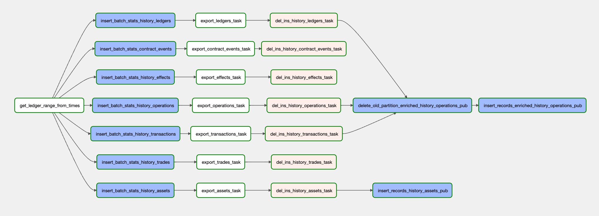
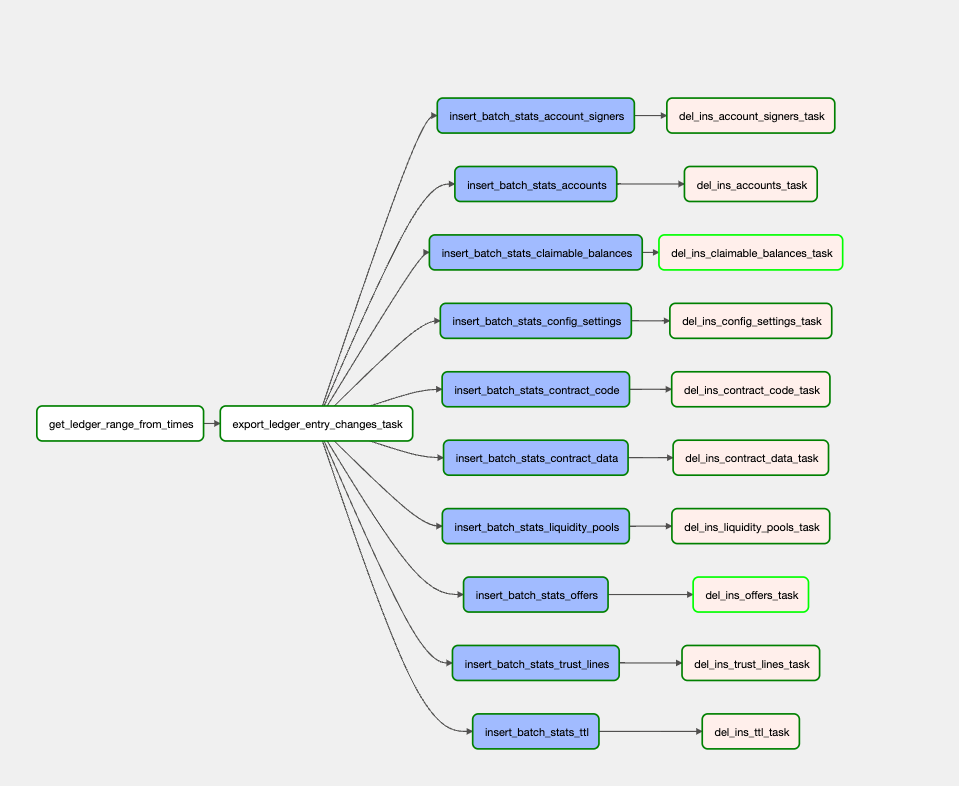

# stellar-etl-airflow

This repository contains the Airflow DAGs for the [Stellar ETL](https://github.com/stellar/stellar-etl) project. These DAGs provide a workflow for exporting data from the Stellar network and uploading the data into BigQuery.

## **Table of Contents**

- [stellar-etl-airflow](#stellar-etl-airflow)
  - [**Table of Contents**](#table-of-contents)
- [Installation and Setup](#installation-and-setup)
  - [**Google Cloud Platform**](#google-cloud-platform)
    - [**Setup the Cloud SDK**](#setup-the-cloud-sdk)
    - [**Create Google Project**](#create-google-project)
    - [**Create BigQuery Dataset**](#create-bigquery-dataset)
    - [**Create Google Cloud Storage bucket**](#create-google-cloud-storage-bucket)
  - [**Cloud Composer**](#cloud-composer)
    - [**Create Google Cloud Composer environment**](#create-google-cloud-composer-environment)
    - [**Upload DAGs and Schemas to Cloud Composer**](#upload-dags-and-schemas-to-cloud-composer)
    - [**Add Service Account Key**](#add-service-account-key)
    - [**Add private docker registry auth secrets**](#add-private-docker-registry-auth-secrets)
    - [**Create Namespace for ETL Tasks (Optional)**](#create-namespace-for-etl-tasks-optional)
    - [**Authenticating Tasks in an Autopilot-Managed Environment**](#authenticating-tasks-in-an-autopilot-managed-environment)
    - [**Modify Kubernetes Config for Airflow Workers**](#modify-kubernetes-config-for-airflow-workers)
    - [**Add Airflow Variables and Connections**](#add-airflow-variables-and-connections)
  - [**Airflow Variables Explanation**](#airflow-variables-explanation)
    - [**Normal Variables**](#normal-variables)
    - [**DBT Variables**](#dbt-variables)
    - [**Kubernetes-Specific Variables**](#kubernetes-specific-variables)
- [Execution Procedures](#execution-procedures)
  - [**Starting Up**](#starting-up)
  - [**Handling Failures**](#handling-failures)
    - [**Clearing Failures**](#clearing-failures)
- [Understanding the Setup](#understanding-the-setup)
  - [**DAG Diagrams**](#dag-diagrams)
    - [**Public DAGs**](#public-dags)
      - [**History Table Export DAG**](#history-table-export-dag)
      - [**State Table Export DAG**](#state-table-export-dag)
      - [**DBT Enriched Base Tables DAG**](#dbt-enriched-base-tables-dag)
    - [**SDF Internal DAGs**](#sdf-internal-dags)
      - [**Sandbox DAGs**](#sandbox-dags)
        - [**Sandbox Create DAG**](#sandbox-create-dag)
        - [**Sandbox Update DAG**](#sandbox-update-dag)
      - [**Cleanup Metadata DAG**](#cleanup-metadata-dag)
      - [**Partner Pipeline DAG**](#partner-pipeline-dag)
      - [**DBT Stellar Marts DAG**](#dbt-stellar-marts-dag)
      - [**DBT Data Quality Alerts DAG**](#dbt-data-quality-alerts-dag)
      - [**Daily Euro OHLC DAG**](#daily-euro-ohlc-dag)
      - [**Audit Log DAG**](#audit-log-dag)
  - [**Task Explanations**](#task-explanations)
    - [**build_time_task**](#build_time_task)
    - [**build_export_task**](#build_export_task)
    - [**build_gcs_to_bq_task**](#build_gcs_to_bq_task)
    - [**build_apply_gcs_changes_to_bq_task**](#build_apply_gcs_changes_to_bq_task)
    - [**build_batch_stats**](#build_batch_stats)
    - [**bq_insert_job_task**](#bq_insert_job_task)
    - [**cross_dependency_task**](#cross_dependency_task)
    - [**build_delete_data_task**](#build_delete_data_task)
    - [**build_copy_table_task**](#build_copy_table_task)
    - [**build_coingecko_api_to_gcs_task**](#build_coingecko_api_to_gcs_task)
    - [**build_check_execution_date_task**](#build_check_execution_date_task)
    - [**build_dbt_task**](#build_dbt_task)
    - [**build_elementary_slack_alert_task**](#build_elementary_slack_alert_task)
- [Further Development](#further-development)
  - [**Extensions**](#extensions)
    - [**Pre-commit Git hook scripts**](#pre-commit-git-hook-scripts)
    - [**Adding New DAGs**](#adding-new-dags)
    - [**Adding tasks to existing DAGs**](#adding-tasks-to-existing-dags)
    - [**Adding New Tasks**](#adding-new-tasks)
  - [**Testing Changes**](#testing-changes)

<br>

---

# Installation and Setup

- [Google Cloud Platform](#google-cloud-platform)
- [Cloud Composer](#cloud-composer)
- [Airflow Variables Explanation](#airflow-variables-explanation)
  - [Normal Variables](#normal-variables)
  - [Kubernetes Specific Variables](#kubernetes-specific-variables)

<br>

---

## **Google Cloud Platform**

Below are instructions to intialize the Google Cloud SDK and create the GCP project, dataset, and GCS bucket if needed.

### **Setup the Cloud SDK**

- Download the [Google Cloud SDK](https://cloud.google.com/sdk/docs/quickstart#installing_the_latest_version).
- [Initialize the Cloud SDK](https://cloud.google.com/sdk/docs/quickstart#initializing_the) and login to your Google account

### **Create Google Project**

- Login to the [Google Cloud Console](https://console.cloud.google.com/cloud-resource-manager)
- Create a new [Google Project](https://cloud.google.com/resource-manager/docs/creating-managing-projects#creating_a_project) or use an existing project
  > **_NOTE:_** The project name you choose corresponds to the Airflow variable "bq_project".

### **Create BigQuery Dataset**

- Log in to Google [BigQuery](https://cloud.google.com/bigquery)
- [Create](https://cloud.google.com/bigquery/docs/datasets#create-dataset) a new dataset with the desired name or use an existing dataset
  > **_NOTE:_** The dataset name you choose corresponds to the Airflow variable "bq_dataset".

### **Create Google Cloud Storage bucket**

- Open the [Cloud Storage browser](https://console.cloud.google.com/storage/browser)
- [Create](https://cloud.google.com/storage/docs/creating-buckets) a new Google Storage bucket that will store exported files

  > **_NOTE:_** Creating a new Cloud Composer environment will automatically create a new GCS bucket which corresponds to the Airflow variable "gcs_exported_data_bucket_name".

> **_WARNING:_** Make sure that you adhere to the [location requirements](https://cloud.google.com/bigquery/docs/batch-loading-data#data-locations) for Cloud Storage buckets and BigQuery datasets. Otherwise, it will not be possible to upload data to BigQuery.

<br>

---

## **Cloud Composer**

Cloud Composer is the preferred method of deployment. [Cloud Composer](https://cloud.google.com/composer) is a managed service used for Airflow deployment that provides much of the infrastructure required to host an Airflow instance. The steps for setting up a Cloud Composer environment are detailed below.

> _*Note:*_ more general instructions for setting up the environment can be found [here](https://cloud.google.com/composer/docs/composer-2/create-environments)

<br>

---

### **Create Google Cloud Composer environment**

Create a new Cloud Composer environment using the [UI](https://console.cloud.google.com/composer/environments/create) or by following the setup instructions in [Create Cloud Composer environments](https://cloud.google.com/composer/docs/how-to/managing/creating)
Cloud Composer may take a while to setup the environment. Once the process is finished, you can view the environment by going to the [Composer section of the Cloud Console](https://console.cloud.google.com/composer/environments).

> _*Note:*_ Cloud Composer 1 is in the post-maintenance mode. Google does not release any further updates to Cloud Composer 1, including new versions of Airflow, bugfixes, and security updates. [Composer 1](https://cloud.google.com/composer/docs/concepts/overview)

> _*For Cloud Composer 2:*_ Be wary of the default "autopilot" mode for environment resource management. The ephemeral storage provided by autopilot-ed containers is [capped at 10GB](https://cloud.google.com/kubernetes-engine/docs/concepts/autopilot-resource-requests#min-max-requests), which may not be enough for hefty tasks (such as `state_table_dag`'s `export_task`) run with `captive-core`. One workaround to provide captive-core with the storage it needs is to [mount a volume to the KubernetesPod](https://darsh7.medium.com/cloud-composer-gce-persistent-disk-volume-for-kubernetespodoperator-cbca3ea57e39) and have captive-core run from that mounted volume rather than the ephemeral storage supplied by default.

> _*Note*_: If no service account is provided, GCP will use the default GKE service account. For quick setup this is an easy option.
> Remember to adjust the disk size, machine type, and node count to fit your needs. The python version must be 3, and the image must be `composer-2.7.1-airflow-2.6.3` or later. GCP deprecates support for older versions of composer and airflow. It is recommended that you select a stable, latest version to avoid an environment upgrade. See [the command reference page](https://cloud.google.com/sdk/gcloud/reference/composer/environments/create) for a detailed list of parameters.

> _*TROUBLESHOOTING:*_ If the environment creation fails because the "Composer Backend timed out" try disabling and enabling the Cloud Composer API. If the creation fails again, try creating a service account with `Owner` permissions and use it to create the Composer environment.

> _*NOTE:*_ Creating an environment will also create a new Google Cloud Storage bucket. You can check this bucket's name by clicking on the DAGs folder link in the Composer section of the Cloud Console.

<br>

### **Upload DAGs and Schemas to Cloud Composer**

After the environment is created, select the environment and navigate to the environment configuration tab. Look for the value under **DAGs folder**. It will be of the form `gs://airflow_bucket/dags`. The `airflow_bucket` value will be used in this step and the next. Run the command below in order to upload the DAGs and schemas to your Airflow bucket.

```bash
> bash upload_static_to_gcs.sh <airflow_bucket>
```

Afterwards, you can navigate to the Airflow UI for your Cloud Composer environment. To do so, navigate to the [Composer section of the Cloud Console](https://console.cloud.google.com/composer/environments), and click the link under `Airflow webserver`. Then, pause the DAGs by clicking the on/off toggle to the left of their names. DAGs should remain paused until you have finished setting up the environment. Some DAGs may not show up due to errors that will be fixed as the following steps are completed.

<br>

### **Add Service Account Key**

The Airflow DAGs require service account keys to perform their operations. Generate a [service account key](https://cloud.google.com/iam/docs/creating-managing-service-account-keys#creating_service_account_keys) for a service account that has access to BigQuery and Google Cloud Storage. Then, add this key file to the data folder in your `airflow_bucket`.

> **_NOTE:_** The name of the key file corresponds to the Airflow variable `api_key_path`. The data folder in Cloud Storage corresponds to the path `/home/airflow/gcs/data/`, but ensure that the variable has the correct filename.

> **_NOTE:_** It is also possible to save the generated [service account key](https://cloud.google.com/iam/docs/creating-managing-service-account-keys#creating_service_account_keys) in [GCP Secret Manager](https://cloud.google.com/secret-manager/docs).
> There are extra steps to enable the workers to access the secrets. Instructions can be found [here](https://cloud.google.com/composer/docs/composer-2/configure-secret-manager)

<br>

### **Add private docker registry auth secrets**

If you want to pull an image from a private docker registry to use in `KubernetesPodOperator` in airflow you will need to add auth json credentials to kubernetes and the service account. [Kubernetes docs](https://kubernetes.io/docs/tasks/configure-pod-container/pull-image-private-registry/#registry-secret-existing-credentials)

- Create the kubernetes secret from auth json

```
kubectl create secret generic <secret name> \
    --from-file=.dockerconfigjson=<path/to/.docker/config.json> \
    --type=kubernetes.io/dockerconfigjson
```

- Add secret to service account that will create the kubernetes pod

```
kubectl patch serviceaccount <serviceaccount name> -p '{"imagePullSecrets": [{"name": "<secret-name>"}]}' --namespace=<namespace>
```

<br>

### **Create Namespace for ETL Tasks (Optional)**

Open the Google [Cloud Shell](https://cloud.google.com/shell). Run these commands:

```bash
gcloud container clusters get-credentials <cluster_name> --region=<composer_region>

kubectl create ns <namespace_name>

kubectl create clusterrolebinding default-admin --clusterrole cluster-admin \
--serviceaccount=<service_account> --namespace <namespace_name>
```

The first command acquires credentials, allowing you to execute the next commands. The second command creates the new namespace, and the third allows the service account that executes tasks to act in the new namespace.

To find the value of `<airflow_worker_namespace>`, select your Cloud Composer environment, navigate to the `ENVIRONMENT CONFIGURATION` tab, and look for the value of `GKE cluster`. Click on the link that says `view cluster workloads`.

A new page will open with a list of Kubernetes workflows. Click on `airflow-worker` in order to go to the details page for that Deployment. Look for the value of `Namespace`.

> **_NOTE:_** The name of the newly created namespace corresponds to the Airflow variable `namespace`.

<br>

### **Authenticating Tasks in an Autopilot-Managed Environment**

There are a few extra hoops to jump through to configure Workload Identity, so that `export` tasks have permissions to upload files to GCS.
You will be creating a Kubernetes service account, and bind it to a Google service account that your task is authenticated as.
Steps taken from this [doc](https://cloud.google.com/kubernetes-engine/docs/how-to/workload-identity#authenticating_to).

- Create a namespace in the k8s cluster where the Composer env is running:

  ```bash
  kubectl create namespace <namespace_name>
  ```

- Create a k8s service account:

  ```bash
  kubectl create serviceaccount <service_account_name> \
      --namespace <namespace_name>
  ```

- Create a Google service account, if one doesn't already exist:

  ```bash
  gcloud iam service-accounts create <service_account_name> \
      --project=<project_id>
  ```

- Grant the Google service account that you're using `storage.objectAdmin` permissions, it doesn't already have it.

  ```bash
  gcloud projects add-iam-policy-binding hubble-261722 \
    --member "<Google service account>" \
    --role "roles/storage.objectAdmin"
  ```

- Associate the Google and k8s service accounts:

  ```bash
  gcloud iam service-accounts add-iam-policy-binding <Google service account email> \
    --role roles/iam.workloadIdentityUser \
    --member "<k8s service account>"
  ```

- Annotate the k8s service account with the Google service account:

  ```bash
  kubectl annotate serviceaccount <k8s service account> \
      --namespace <namespace_name> \
      iam.gke.io/gcp-service-account=<Google service account>
  ```

- Set the corresponding airflow variables (`k8s_namespace` and `k8s_service_account`) for tasks running on `KubernetesPodOperator`.

<br>

### **Modify Kubernetes Config for Airflow Workers**

Find the Kubernetes cluster workloads that are used by your Cloud Composer environment. To do so, select the environment, navigate to the `ENVIRONMENT CONFIGURATION` tab, and look for the `GKE cluster` section. Click on the link that says `view cluster workloads`.

A new page will open with a list of Kubernetes workflows. Click on `airflow-worker` in order to go to the details page for that Deployment. Click the `edit` button. This will take you to a tab with a Kubernetes configuration. In subsequent steps, you will edit this file. For an example of a finalized config file, see this [example file](example_airflow_worker_config.yaml).

> **_WARNING:_** You shouldn't copy the example file directly because it has environment variables and config values that are set up for a different project.

> **_NOTE:_** This deployment file contains two separate containers: airflow-worker and gcs-syncd. Only the airflow-worker container should be edited.

<details>
<summary>Mount Docker on Airflow Workers</summary>
In this step, mount the Docker.sock and Docker. In addition, edit the security config so that the container runs as privileged, allowing it to access Docker. See [this commit](https://github.com/marc-chan/cloud_composer_examples/commit/f3e6a202ef0bfd2214385def7e36be33db191df6#diff-fc2e428a07c8d60059e54e5154f0c540) for an example of how to make these changes.
</details>

<details>
<summary>Add Volume for Local Files to Airflow Workers</summary>
In this step, add another volumeMount to airflow-workers. This local path will be used for temporary storage of exported files. In addition, make sure that you add the corresponding volume with the type DirectoryOrCreate.

Here is an example of what your volumeMounts and volumes should look like at the end of this step:

```
...

volumeMounts:
- mountPath: /etc/airflow/airflow_cfg
name: airflow-config

- mountPath: /home/airflow/gcs
name: gcsdir

- mountPath: /var/run/docker.sock
name: docker-host

- mountPath: /bin/docker
name: docker-app

- mountPath: /home/airflow/etlData
name: etl-data
...

volumes:
- configMap:
defaultMode: 420
name: airflow-configmap

name: airflow-config
- emptyDir: {}
name: gcsdir

- hostPath:
path: /var/run/docker.sock
type: ""
name: docker-host

- hostPath:
path: /usr/bin/docker
type: ""
name: docker-app

- hostPath:
path: /home/airflow/etlData
type: DirectoryOrCreate
name: etl-data

```

> **_NOTE:_** The mount path chosen corresponds to the Airflow variable `local_output_path`.

</details>

<details>
<summary>Add Poststart Script to Airflow Workers</summary>
Find the namespace name in the airflow-worker config file. It should be near the top of the file, and may look like `composer-2-6-4-airflow-2-6-3-14c4ca64`. This value will be used in later commands.

Next, open the cloud shell. Keep your airflow-worker configuration file open, or save it. In the cloud shell, create a text file called `poststart.sh` by running the command: `nano poststart.sh`. Then, copy the text from the `poststart.sh` file in this repository into the newly opened file.

- If you changed the path for the local folder in the previous step, make sure that you edit line 13:

  ```
  for file in /home/airflow/etlData/*
  ```

- It should reflect the path changes you made. Once the file is finalized, run these commands:

  ```bash
  gcloud container clusters get-credentials <cluster_name> --region=<composer_region>

  kubectl create configmap start-config --from-file poststart.sh -n <namespace_name>
  ```

- Return to the airflow-worker config file. Add a new volumeMount to /etc/scripts.

  ```
  ...

  volumeMounts:
  ...
  - mountPath: /etc/scripts
  name: config-volume
  ...

  ```

- Then, add a new Volume that links to the configMap you created.

  ```
  ...
  volumes:
  ...
  - configMap:
  	defaultMode: 511
  	name: start-config
  	name: config-volume
  ...
  ```

- This will make the script available to the Airflow workers. In order for them to call it automatically, add a postStart hook to airflow-worker above the existing preStop hook.

  ```
  ...
  lifecycle:
  	postStart:
  		exec:
  			command:
  				- /bin/bash
  				- /etc/scripts/poststart.sh
  preStop:
  	exec:
  		command:
  			- bash
  			- -c
  			- pkill -f "MainProcess"
  ...
  ```

<details>
<summary>Click here if you are interested in knowing what the script does.</summary>

The export tasks in the etl use Docker images with their own filesystems. Mounting a folder to the Docker image allows us to connect the airflow-worker filesystem to the Docker image filesystem. However, there are multiple airflow-worker instances, and tasks are distributed between them. This means that an export task may occur on one worker, and the subsequent task that needs that file could occur on a different worker instance. There needs to be some way to pool all the data from all the worker instances.

Fortunately, Cloud Composer provides a folder at /home/airflow/gcs/data. This folder is described in detail [here](https://cloud.google.com/composer/docs/concepts/cloud-storage). Essentially, the folder is synchronized between all the workers, and it also is linked to the data folder in the environment's Cloud Storage bucket. This means that data stored here will be available to all workers, solving the problem. Unfortunately, since this folder is already connected to a Cloud Storage bucket, it cannot also connect to a Docker image.

Instead, we connect a local folder defined in the previous step. The `poststart.sh` script runs constantly in the background. It moves files from the local folder to the gcs/data folder. The script is more complicated than a simple move command because it needs to ensure that no programs are writing to the files before they are moved.

</details>
</details>

<br>

### **Add Airflow Variables and Connections**

In order to add the Airflow variables and connections, navigate to the Airflow web server. To do so, navigate to the [Composer section of the Cloud Console](https://console.cloud.google.com/composer/environments), and click the link under `Airflow Webserver`.

Click the Admin tab, then Connections. Click create, then:

- Set the `Conn Id` field to `google_cloud_platform_connection`.
- Set the `Conn Type` to `Google Cloud Platform`.
- Set the `Project Id` to your project id
- Set the `Keyfile Path` to `<api_key_path>`.
- The `<api_key_path>` should be the same as the Airflow variable `api_key_path`.

Next, add the Airflow variables. Click the Admin tab, then Variables. Click the `Choose file` button, select your variables file, and click import variables.

The `airflow_variables_*.txt` files provide a set of default values for variables.

<br>

---

## **Airflow Variables Explanation**

### **Normal Variables**

| Variable name                 | Description                                                                                                                     | Should be changed?                                                    |
| ----------------------------- | ------------------------------------------------------------------------------------------------------------------------------- | --------------------------------------------------------------------- |
| api_key_path                  | Path to the Google Cloud Platform [API key](https://cloud.google.com/docs/authentication/api-keys?authuser=1)                   | No, unless your filename is different.                                |
| bq_dataset                    | Name of the BigQuery [dataset](https://cloud.google.com/bigquery/docs/datasets)                                                 | Yes. Change to your dataset name.                                     |
| bq_project                    | Name of the BigQuery [project](https://cloud.google.com/resource-manager/docs/creating-managing-projects#console)               | Yes. Change to your project name.                                     |
| cluster_fields                | JSON object. Each key should be a BigQuery table, and the value is a list of columns that the table is clustered by             | Yes, if desired for tables that want clustering                       |
| gcs_exported_data_bucket_name | Name of the Google Cloud Storage [bucket](https://cloud.google.com/storage/docs/creating-buckets) that will store exported data | Yes. Change to the name of the bucket you made.                       |
| gcs_exported_object_prefix    | String to prefix run_id export task output path with                                                                            | Yes, if desired to prefix run_id                                      |
| image_name                    | Name of the ETL's Docker image                                                                                                  | No, unless you need a specific image version.                         |
| image_output_path             | Local output path within the ETL image                                                                                          | No.                                                                   |
| image_pull_policy             | Specifies how image pull behavior. Valid values are: `Always`, `IfNotPresent`, or `Never`                                       | No, unless you handle image updates manually.                         |
| local_output_path             | Local output path within the airflow-worker that is used for temporary storage                                                  | No, unless you changed the path when modifying the Kubernetes config. |
| namespace                     | Namespace name for ETL tasks that generate Kubernetes pods                                                                      | Yes, if you followed the optional step and made a new namespace       |
| output_file_names             | JSON object. Each key should be a data structure, and the value should be the name of the output file for that data structure   | Yes, if desired. Make sure each type has a different filename.        |
| output_path                   | Shared output path for exported data                                                                                            | No, unless you have a different shared storage solution.              |
| owner                         | The name of the owner of the Airflow DAGs                                                                                       | Yes.                                                                  |
| partition_fields              | JSON object. Each key should be a BigQuery table, and the value is a JSON object of type and field to partition by              | Yes, if desired for tables that want partitioning                     |
| public_dataset                | Name of the BigQuery [dataset](https://cloud.google.com/bigquery/docs/datasets)                                                 | Yes. Change to your dataset name.                                     |
| public_project                | Name of the BigQuery [project](https://cloud.google.com/resource-manager/docs/creating-managing-projects#console)               | Yes. Change to your project name.                                     |
| sentry_dsn                    | Sentry Data Source Name to tell where Sentry SDK should send events                                                             | Yes                                                                   |
| sentry_environment            | Environment that sentry alerts will fire                                                                                        | Yes                                                                   |
| schema_filepath               | File path to schema folder                                                                                                      | No, unless schemas are in a different location                        |
| table_ids                     | JSON object. Each key should be a data structure, and the value should be the name of the BigQuery table                        | Yes, if desired. Make sure each type has a different table name.      |
| task_timeout                  | JSON object. Each key should be the airflow util task name, and the value is the timeout in seconds                             | Yes, if desired to give tasks timeout                                 |
| use_testnet                   | Flag to use testnet data instead of pubnet                                                                                      | Yes, if desired to use testnet data                                   |
| use_futurenet                 | Flag to use futurenet data instead of pubnet                                                                                    | Yes, if desired to use futurenet data                                 |
| use_captive_core              | Flag to use captive-core instead of the txmeta datastore                                                                        | Yes, if desired to run with captive-core                              |
| txmeta_datastore_path         | Bucket path to the txmeta datastore                                                                                             | Yes, change to your txmeta bucket path                                |

### **DBT Variables**

| Variable name                     | Description                                                                                                                          | Should be changed?                                        |
| --------------------------------- | ------------------------------------------------------------------------------------------------------------------------------------ | --------------------------------------------------------- |
| dbt_full_refresh_models           | JSON object. Each key should be a DBT model, and the value is a boolean controlling if the model should be run with `--full-refresh` | Yes, if desired for models that need to be full-refreshed |
| dbt_image_name                    | name of the `stellar-dbt` image to use                                                                                               | No, unless you need a specific image version              |
| dbt_job_execution_timeout_seconds | timeout for dbt tasks in seconds                                                                                                     | No, unless you want a different timeout                   |
| dbt_job_retries                   | number of times dbt_jobs will retry                                                                                                  | No, unless you want a different retry limit               |
| dbt_mart_dataset                  | Name of the BigQuery [dataset](https://cloud.google.com/bigquery/docs/datasets) for DBT marts                                        | Yes. Change to your dataset name                          |
| dbt_maximum_bytes_billed          | the max number of BigQuery bytes that can be billed when running DBT                                                                 | No, unless you want a different limit                     |
| dbt_project                       | name of the Biquery [project](https://cloud.google.com/resource-manager/docs/creating-managing-projects#console)                     | Yes. Change to your project name                          |
| dbt_target                        | the `target` that will used to run dbt                                                                                               | No, unless you want a different target                    |
| dbt_threads                       | the number of threads that dbt will spawn to build a model                                                                           | No, unless you want a different thread count              |
| dbt_tables                        | name of dbt tables to copy to sandbox                                                                                                | No                                                        |
| dbt_internal_source_db            | Name of the BigQuery [project](https://cloud.google.com/resource-manager/docs/creating-managing-projects#console)                    | Yes. Change to your project name.                         |
| dbt_internal_source_schema        | Name of the BigQuery [dataset](https://cloud.google.com/bigquery/docs/datasets)                                                      | Yes. Change to your dataset name.                         |
| dbt_public_source_db              | Name of the BigQuery [project](https://cloud.google.com/resource-manager/docs/creating-managing-projects#console)                    | Yes. Change to your project name.                         |
| dbt_public_source_schema          | Name of the BigQuery [dataset](https://cloud.google.com/bigquery/docs/datasets)                                                      | Yes. Change to your dataset name.                         |
| dbt_slack_elementary_channel      | Name of slack channel to send elementary alerts                                                                                      | Yes. Change to your slack channel name.                   |
| dbt_elementary_dataset            | Name of the BigQuery [dataset](https://cloud.google.com/bigquery/docs/datasets)                                                      | Yes. Change to your dataset name.                         |
| dbt_elementary_secret             | Necessary argument for elementary task                                                                                               | No                                                        |

### **Kubernetes-Specific Variables**

| Variable name            | Description                                                                                                                                                                                                                                                                                 | Should be changed?                                                                                     |
| ------------------------ | ------------------------------------------------------------------------------------------------------------------------------------------------------------------------------------------------------------------------------------------------------------------------------------------- | ------------------------------------------------------------------------------------------------------ |
| resources                | Resources to request and allocate to Kubernetes Pods.                                                                                                                                                                                                                                       | No, unless pods need more resources                                                                    |
| kube_config_location     | Location of the kubernetes config file. See [here](https://www.astronomer.io/docs/cloud/stable/develop/kubepodoperator-local#get-your-kube-config) for a guide on finding the Kube config file. If you are running the pods in the same cluster as Airflow, you can leave this value blank. | No, unless the pods are in a different cluster than Airflow.                                           |
| kubernetes_sidecar_image | Image used for xcom sidecar                                                                                                                                                                                                                                                                 | No, unless you want to pull a different alpine-based image.                                            |
| k8s_namespace            | Namespace to run the task in                                                                                                                                                                                                                                                                | No, unless the pods are moved into a new namespace                                                     |
| k8s_service_account      | K8s service account the task runs as                                                                                                                                                                                                                                                        | No, unless k8s authentication is modified, and is likely linked to the associated GCP service account. |
| volume_config            | JSON objects representing the configuration for your Kubernetes volume.                                                                                                                                                                                                                     | Yes. Change configs to match your volume (see below for example configs)                               |
| volume_name              | Name of the persistent ReadWriteMany volume associated with the claim.                                                                                                                                                                                                                      | Yes. Change to your volume name.                                                                       |

Here are some example `volume_config` values. Note that a ReadWriteMany volume is required when tasks run in parallel.

- For a an NFS volume set `volume_config={"nfs": {"path": "/", "server": "my-server.provider.cloud"}}`.
- In order to set up a persistent volume claim, set `volume_config={"persistentVolumeClaim":{"claimName": <claim>}`
- In order to set up a host path volume, set `volume_config="hostPath":{"path": <path>, "type": "DirectoryOrCreate"}}`

<br>

---

# Execution Procedures

- [Starting Up](#starting-up)
- [Handling Failiures](#handling-failures)
  - [Clearing Failures](#clearing-failures)

## **Starting Up**

> **_NOTE:_** Google Cloud Composer instance of airflow has limited CLI support.
> [Supported Airflow CLI commands](https://cloud.google.com/composer/docs/composer-2/access-airflow-cli#supported-commands)

First, this [image](https://airflow.apache.org/docs/apache-airflow/2.7.3/ui.html#dags-view) shows the Airflow web UI components for pausing and triggering DAGs:

- Ensure that the Airflow scheduler is running: `airflow scheduler`
- Ensure that the Airflow web server is running: `airflow webserver -p <port>`
- Enable the DAGs
  - Use the command `airflow unpause <DAG name>` or use the Airflow UI

## **Handling Failures**

### **Clearing Failures**

You can clear failed tasks in the [grid-view](https://airflow.apache.org/docs/apache-airflow/2.7.3/ui.html#grid-view) in the Airflow UI. Clearing failed tasks gives them a chance to run again without requiring you to run the entire DAG again.

<br>

---

# Understanding the Setup

This section contains information about the Airflow setup. It includes our DAG diagrams and explanations of tasks. For general Airflow knowledge, check out the Airflow [concepts overview](https://airflow.apache.org/docs/apache-airflow/stable/concepts.html) or the Airflow [tutorial](https://airflow.apache.org/docs/apache-airflow/stable/tutorial.html).

- [DAG Diagrams](#dag-diagrams)
  - [Public DAGs](#public-dags)
    - [History Table Export DAG](#history-table-export-dag)
    - [State Table Export DAG](#state-table-export-dag)
    - [DBT Enriched Base Tables DAG](#dbt-enriched-base-tables-dag)
  - [SDF Internal DAGs](#sdf-internal-dags)
    - [Sandbox DAGs](#sandbox-dags)
      - [Sandbox Create DAG](#sandbox-create-dag)
      - [Sandbox Update DAG](#sandbox-update-dag)
    - [Cleanup Metadata DAG](#cleanup-metadata-dag)
    - [Partner Pipeline DAG](#partner-pipeline-dag)
    - [DBT Stellar Marts DAG](#dbt-sdf-marts-dag)
    - [DBT Data Quality Alerts DAG](#dbt-data-quality-alerts-dag)
    - [Daily Euro OHLC DAG](#daily-euro-ohlc-dag)
    - [Audit Log DAG](#audit-log-dag)
- [Task Explanations](#task-explanations)
  - [build_time_task](#build_time_task)
  - [build_export_task](#build_export_task)
  - [build_gcs_to_bq_task](#build_gcs_to_bq_task)
  - [build_apply_gcs_changes_to_bq_task](#build_apply_gcs_changes_to_bq_task)
  - [build_batch_stats](#build_batch_stats)
  - [bq_insert_job_task](#bq_insert_job_task)
  - [cross_dependency_task](#cross_dependency_task)
  - [build_delete_data_task](#build_delete_data_task)
  - [build_dbt_task](#build_dbt_task)
  - [build_elementary_slack_alert_task](#build_elementary_slack_alert_task)

---

## **DAG Diagrams**

- The sources are: ledgers, operations, transactions, trades, effects, claimable_balances, accounts, account_signers, liquidity_pools, offers, trust_lines, config_settings, contract_data, contract_code and assets.

- The DAGs that export the sources are: History Table Export and State Table Export.

- All the other tables that are not listed above are exclusive to internal datasets.

### **Public DAGs**

#### **History Table Export DAG**

[This DAG](https://github.com/stellar/stellar-etl-airflow/blob/master/dags/history_tables_dag.py):

- Exports part of sources: ledgers, operations, transactions, trades, effects and assets from Stellar using CaptiveCore
- Inserts into BigQuery publicly (crypto-stellar).



#### **State Table Export DAG**

[This DAG](https://github.com/stellar/stellar-etl-airflow/blob/master/dags/state_table_dag.py)

- Exports accounts, account_signers, offers, claimable_balances, liquidity pools, trustlines, contract_data, contract_code, config_settings and ttl.
- Inserts into BigQuery publicly (crypto stellar).



#### **DBT Enriched Base Tables DAG**

[This DAG](https://github.com/stellar/stellar-etl-airflow/blob/master/dags/dbt_enriched_base_tables_dag.py)

- Creates the DBT staging views for models
- Updates the enriched_history_operations table
- Updates the current state tables


### **SDF Internal DAGs**

#### **Sandbox DAGs**

- The sandbox dags are used to provide Canvas with a subset of network data that will fit within their systems
- The tables contain 6 months of the targeted environment's (pubnet, testnet, or futurenet) data.

##### **Sandbox Create DAG**

- This DAG runs only once and creates the Canvas sandbox dataset with copies of transactions tables, state tables, and current state views.

##### **Sandbox Update DAG**

[This DAG](https://github.com/stellar/stellar-etl-airflow/blob/master/dags/sandbox_update_dag.py)

- This DAG update the Canvas sandbox dataset with transactions tables and state tables with history once a daily.


#### **Cleanup Metadata DAG**

[This DAG](https://github.com/stellar/stellar-etl-airflow/blob/master/dags/cleanup_metadata_dag.py)

- A maintenance workflow that you can deploy into Airflow to periodically clean
  out the DagRun, TaskInstance, Log, XCom, Job DB and SlaMiss entries to avoid
  having too much data in your Airflow MetaStore.


#### **Partner Pipeline DAG**

[This DAG](https://github.com/stellar/stellar-etl-airflow/blob/master/dags/partner_pipeline_dag.py)

- Used by SDF for internal partnership pipelines

#### **DBT Stellar Marts DAG**

[This DAG](https://github.com/stellar/stellar-etl-airflow/blob/master/dags/dbt_stellar_marts_dag.py)

- Updates the DBT mart tables daily


#### **DBT Data Quality Alerts DAG**

[This DAG](https://github.com/stellar/stellar-etl-airflow/blob/master/dags/dbt_data_quality_alerts_dag.py)

- Runs DBT tests tagged as `singular_test` in `stellar-dbt` and elementary alerts at a half-hourly cadence
- If found any warnings, it sends a Slack notification about what table has a warning, the time and date it ocurred.


#### **Daily Euro OHLC DAG**

[This DAG](https://github.com/stellar/stellar-etl-airflow/blob/master/dags/daily_euro_ohlc_dag.py)

- Updates the currency table in Bigquey for Euro


#### **Audit Log DAG**

[This DAG](https://github.com/stellar/stellar-etl-airflow/blob/master/dags/audit_log_dag.py)

- Runs an audit log SQL to update the audit log dashboard


<br>

---

## **Task Explanations**

### **build_time_task**

[This file](https://github.com/stellar/stellar-etl-airflow/blob/master/dags/stellar_etl_airflow/build_time_task.py) contains methods for creating time tasks. Time tasks call the get_ledger_range_from_times function in the stellar-etl Docker image. The tasks receive the execution time of the current DAG run and the expected execution time of the next run. They convert this time range into a ledger range that can be passed to the export tasks.

### **build_export_task**

[This file](https://github.com/stellar/stellar-etl-airflow/blob/master/dags/stellar_etl_airflow/build_export_task.py) contains methods for creating export tasks. Export tasks call export functions in the stellar-etl Docker image with a ledger range determined by the upstream time task. The data is exported in a newline-delimited JSON text file with a file name in the format `[start ledger]-[end ledger]-[data type].txt`.

### **build_gcs_to_bq_task**

[This file](https://github.com/stellar/stellar-etl-airflow/blob/master/dags/stellar_etl_airflow/build_gcs_to_bq_task.py) contains methods for creating tasks that appends information from a Google Cloud Storage file to a BigQuery table. These tasks will create a new table if one does not exist. These tasks are used for history archive data structures, as Stellar wants to keep a complete record of the ledger's entire history.

### **build_apply_gcs_changes_to_bq_task**

[This file](https://github.com/stellar/stellar-etl-airflow/blob/master/dags/stellar_etl_airflow/build_apply_gcs_changes_to_bq_task.py) contains methods for creating apply tasks. Apply tasks are used to merge a file from Google Cloud Storage into a BigQuery table. Apply tasks differ from the other task that appends in that they apply changes. This means that they update, delete, and insert rows. These tasks are used for accounts, offers, and trustlines, as the BigQuery table represents the point in time state of these data structures. This means that, for example, a merge task could alter the account balance field in the table if a user performed a transaction, delete a row in the table if a user deleted their account, or add a new row if a new account was created.

Apply tasks can also be used to insert unique values only. This behavior is used for orderbook and history archive data structures. Instead of performing a merge operation, which would update or delete existing rows, the task will simply insert new rows if they don't already exist. This helps prevent duplicated data in a scenario where rows shouldn't change or be deleted. Essentially, this task replicates the behavior of a primary key in a database when used for orderbooks.

### **build_batch_stats**

[This file](https://github.com/stellar/stellar-etl-airflow/blob/master/dags/stellar_etl_airflow/build_batch_stats.py) pulls and inserts batch stats into BigQuery.
Data is inserted into `history_archives_dag_runs`.

### **bq_insert_job_task**

[This file](https://github.com/stellar/stellar-etl-airflow/blob/master/dags/stellar_etl_airflow/build_bq_insert_job_task.py) contains methods for creating BigQuery insert job tasks.
The task will read the query from the specified sql file and will return a BigQuery job operator configured to the GCP project and datasets defined.

### **cross_dependency_task**

[This file](https://github.com/stellar/stellar-etl-airflow/blob/master/dags/stellar_etl_airflow/build_cross_dependency_task.py) creates an ExternalTaskSensor that triggers on specified DAG tasks's success.

### **build_delete_data_task**

[This file](https://github.com/stellar/stellar-etl-airflow/blob/master/dags/stellar_etl_airflow/build_delete_data_task.py) deletes data from a specified BigQuery `project.dataset.table` according to the batch interval.

> _*NOTE:*_ If the batch interval is changed, the deleted data might not align with the prior batch intervals.

### **build_copy_table_task**

[This file](https://github.com/stellar/stellar-etl-airflow/blob/master/dags/stellar_etl_airflow/build_copy_table_task.py) copies a table from an specified BigQuery `project.dataset.table` to its destination inside of an specific project and dataset.

### **build_coingecko_api_to_gcs_task**

[This file](https://github.com/stellar/stellar-etl-airflow/blob/master/dags/stellar_etl_airflow/build_coingecko_api_to_gcs_task.py) creates a CSV file from the CoinGecko API and uploads it to Google Cloud Storage, inside of a bucket.
The file is named after the destination_blob_name parameter and the columns parameter is used to create the CSV file with the specified columns.

### **build_check_execution_date_task**

[This file](https://github.com/stellar/stellar-etl-airflow/blob/master/dags/stellar_etl_airflow/build_check_execution_date_task.py) checks if the current date is in the list of dates that are set to reset the DAG.
If the current date is in the list, the DAG will continue to run the tasks that are set to run on the reset date. If the current date is not in the list, the DAG will stop running the tasks that are set to run on the reset date.

### **build_dbt_task**

[This file](https://github.com/stellar/stellar-etl-airflow/blob/master/dags/stellar_etl_airflow/build_dbt_task.py) contains methods for creating dbt tasks. DBT tasks run `dbt build` for the specified model.

### **build_elementary_slack_alert_task**

[This file](https://github.com/stellar/stellar-etl-airflow/blob/master/dags/stellar_etl_airflow/build_elementary_slack_alert_task.py) contains methods for enabling the elementary slack alerts.

<br>

---

# Further Development

This section details further areas of development. It covers a basic guide on how to add new features and test changes to existing features. It also contains a list of project TODOs (check the GitHub [issues page](https://github.com/stellar/stellar-etl-airflow/issues) for more!)

---

## **Extensions**

This section covers some possible extensions or further work that can be done.

- [Pre-commit Git hook scripts](#pre-commit-git-hook-scripts)
- [Adding New DAGs](#adding-new-dags)
- [Adding tasks to existing DAGs](#adding-tasks-to-existing-dags)
- [Adding New Tasks](#adding-new-tasks)

<br>

### **Pre-commit Git hook scripts**

Git can run special scripts at various places in the Git workflow (which the system calls hooks).
These scripts can do whatever you want and, in theory, can help a team with their development flow.

`pre-commit` makes hook scripts extremely accessible to teams.

- Install `pre-commit`

  ```bash
  # using pip
  $ pip install pre-commit==3.2.1
  ```

- Set up the Git hook scripts

  ```bash
  $ pre-commit install
  pre-commit installed at .git/hooks/pre-commit
  ```

That's it. Now `pre-commit` will run automatically on `git commit`!

<br>

### **Adding New DAGs**

Adding new DAGs is a fairly straightforward process. Create a new python file in the `dags` folder. Create your dag object using the code below:

```
dag = DAG(
	'dag_id',
	default_args=get_default_dag_args(),
	description='DAG description.',
	schedule_interval=None,
)
```

The `get_default_dag_args()` is defined in the [dags/stellar-etl-airflow/default.py](https://github.com/stellar/stellar-etl-airflow/blob/master/dags/stellar_etl_airflow/default.py) file.

Feel free to add more arguments or customize the existing ones. The documentation for a DAG is available [here](https://airflow.apache.org/docs/stable/_api/airflow/models/dag/index.html).

<br>

### **Adding tasks to existing DAGs**

If you have created a new DAG, or wish to extend an existing DAG, you can add tasks to it by calling the various `create_X_task` functions that are in the repository. See [here](https://airflow.apache.org/docs/stable/concepts.html#relations-between-tasks) for details on how to create dependencies between tasks.

<br>

### **Adding New Tasks**

Adding new tasks is a more involved process. You likely need to add a new python file in the `dags/stellar_etl_airflow` folder. This file should include a function that creates and returns the new task, as well as any auxiliary functions related to the task.

Airflow has a variety of operators. The ones that are most likely to be used are:

- [DockerOperator](https://airflow.apache.org/docs/apache-airflow-providers-docker/stable/_api/airflow/providers/docker/operators/docker/index.html#airflow.providers.docker.operators.docker.DockerOperator), which can be used to execute commands within a docker container
- [KubernetesPodOperator](https://airflow.apache.org/docs/apache-airflow-providers-cncf-kubernetes/stable/operators.html), which can start new Kubernetes Pods
- [PythonOperator](https://airflow.apache.org/docs/stable/howto/operator/python.html), which can run Python functions

You may also find this list of [Google-related operators](https://airflow.apache.org/docs/stable/howto/operator/gcp/index.html) useful for interacting with Google Cloud Storage or BigQuery.

An example of a simple task is the [time task](https://github.com/stellar/stellar-etl-airflow/blob/master/dags/stellar_etl_airflow/build_time_task.py). This task converts a time into a ledger range using a stellar-etl command. Since it needs to use the stellar-etl, we need a KubernetesPodOperator. We provide the operator with the command, the task_id, the parent DAG, and some parameters specific to KubernetesPodOperator.

More complex tasks might require a good amount of extra code to set up variables, authenticate, or check for errors. However, keep in mind that tasks should be idempotent. This means that tasks should produce the same output even if they are run multiple times. The same input should always produce the same output.

You may find that you need to pass small amounts of information, like filenames or numbers, from one task to another. You can do so with Airflow's [XCOM system](https://airflow.apache.org/docs/stable/concepts.html?highlight=xcom#xcoms).

<br>

## **Testing Changes**

Once you make a change, you can test it using the Airflow command line interface. Here's a quick outline of how to test changes:

- Run `kubectl get pods --all-namespaces`. Look for a pod that starts with `airflow-worker`.
- Run `kubectl -n <pod_namespace> exec -it airflow-worker-<rest_of_pod_name> -c airflow-worker -- /bin/bash` to get inside the worker
- Run `airflow task test history_archive_export <task_id> <test_date>`. Note that if the task you changed has dependencies, you need to run `airflow test` on those upstream tasks for the exact same date.
- Run `airflow task test` on the tasks that depend on the the task you just changed. Ensure that they still perform as expected.

This guide can also be useful for testing deployment in a new environment. Follow this testing process for all the taks in your DAGs to ensure that they work end-to-end.

An alternative to the testing flow above is to `trigger` the task in the Airflow UI. From there you are able to view the task status, log, and task details.
